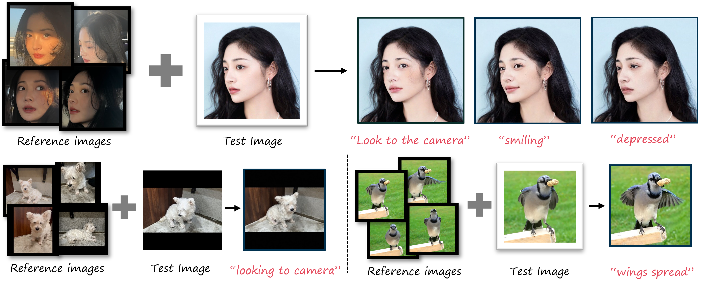

# LIPE: Learning Personalized Identity Prior for Non-rigid Image Editing

> Aoyang Liu1, Qingnan Fan2, Shuai Qin2, Hong Gu2, Yansong Tang1
> 
> 1Tsinghua University, 2VIVO.

>**Abstract**: 
> Although recent years have witnessed significant advancements in image editing thanks to the remarkable progress of text-to-image diffusion models, the problem of non-rigid image editing still presents its complexities and challenges. Existing methods often fail to achieve consistent results due to the absence of unique identity characteristics. In this paper, we present LIPE, a novel framework designed to learn the personalized identity prior from a limited set of images of the same subject, and subsequently employ the learned prior for non-rigid image editing. Our approach comprises two functional designs, EDiting-Oriented personalized identity Prior (EDOP) and Non-rigid Image editing via identity-aware MAsk blend (NIMA), to address the prior learning and image editing challenges, respectively. Experimental results demonstrate the advantages of our approach in various editing scenarios over the past related leading methods in both qualitative and quantitative ways.

